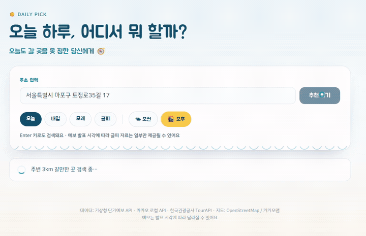

# 안녕하세요, 데이터로 문제를 해결하는 Hyeonah Park입니다 👋

데이터를 수집하고 정리하는 것에서 그치지 않고,  
**분석을 통해 문제를 발견하고 결과를 이해하기 쉽게 전달하는 과정**에 관심이 있습니다.

현재 **데이터 분석 · AI 활용 · 업무 자동화** 분야를 중심으로 프로젝트와 실습을 진행하고 있습니다.

## 🛠 Tech & Tools

### Data Analysis
`Python` `Pandas` `NumPy` `Excel`

### Visualization / BI
`Power BI` `Matplotlib` `Seaborn`

### No-Code / Machine Learning
`Orange3`

### Data Collection / API
`Open API` `REST API` `Web Crawling`

### Collaboration
`GitHub` `Notion`

---

# 📂 Projects

## 🔌 API · Web Application

### 📍 오늘 하루, 어디서 뭐 할까?
**주소와 날씨 정보를 활용한 활동·장소 추천 웹앱**
사용자의 위치와 날씨 데이터를 기반으로  
현재 상황에 적합한 활동과 장소를 추천하는 웹 서비스를 구현했습니다.

🔗 [GitHub Repository](https://github.com/hmh178-gif/daily-pick)  
🌐 [Web Demo](https://daily-pick-project.netlify.app/)

---

## 📊 Power BI

### ☀️ 폭염 취약지역 · 무더위쉼터 사각지대 분석
**폭염 대응이 우선적으로 필요한 지역을 찾기 위한 데이터 분석**

시군구별 폭염일수, 고령인구, 무더위쉼터 등의 데이터를 결합하여  
지역별 폭염 취약성과 쉼터 공급 수준을 비교했습니다.

**4인 팀 프로젝트**
🔗 [Project Repository](https://github.com/hmh178-gif/poakyoem)

## 🐍 Python · Data Analysis

### 🛒 화장품 이커머스 고객 행동 및 구매 퍼널 분석
**고객의 조회 → 장바구니 → 구매 행동 분석**

화장품 이커머스 고객 행동 데이터를 활용하여  
구매 퍼널의 주요 이탈 구간과 구매 전환 특성을 분석한 프로젝트입니다.

**2인 팀 프로젝트**
🔗 [GitHub Repository](https://github.com/hmh178-gif/cosmetics-ecommerce-analysis)

### 📱 통신 3사 지원금 · 요금제 비교 분석
**휴대전화 모델을 기준으로 통신사별 지원금과 요금제를 비교한 데이터 분석 실습**

서로 다른 형태의 통신사 데이터를 휴대전화 모델 기준으로 매칭하여  
지원금 및 요금제 차이를 비교·분석했습니다.
🔗 [GitHub Repository](https://github.com/hmh178-gif/telecom-plan-analysis)

---

## 🧩 Orange3

Orange3를 활용하여 데이터 전처리, 시각화 및 머신러닝 분석을 수행한 프로젝트를 정리하고 있습니다.

> Orange3 프로젝트 추가 예정

---

# 🎯 Currently Learning

## 🛠 기술 스택
- Python 기반 데이터 분석
- SQL 및 데이터 처리
- Power BI 데이터 시각화
- Open API를 활용한 데이터 수집
- AI를 활용한 데이터 분석 및 업무 자동화
- 데이터 분석 프로젝트 기획 및 포트폴리오 구축

## 📌 What I'm Interested In

단순히 데이터를 시각화하는 것을 넘어,

**문제 정의 → 데이터 수집 → 분석 → 인사이트 도출 → 시각화 및 전달**

까지 하나의 흐름으로 수행할 수 있는 데이터 분석가를 목표로 하고 있습니다.

## 📝 학습 기록
공부 과정은 노션에 정리하고 있습니다 → [노션 링크]

## 📫 연락처
[이메일 / 링크드인 등]
